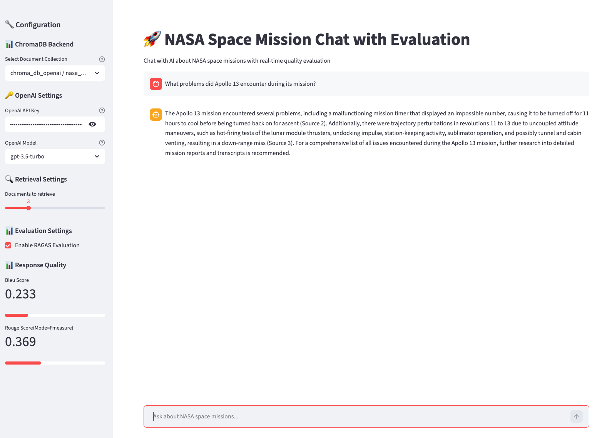
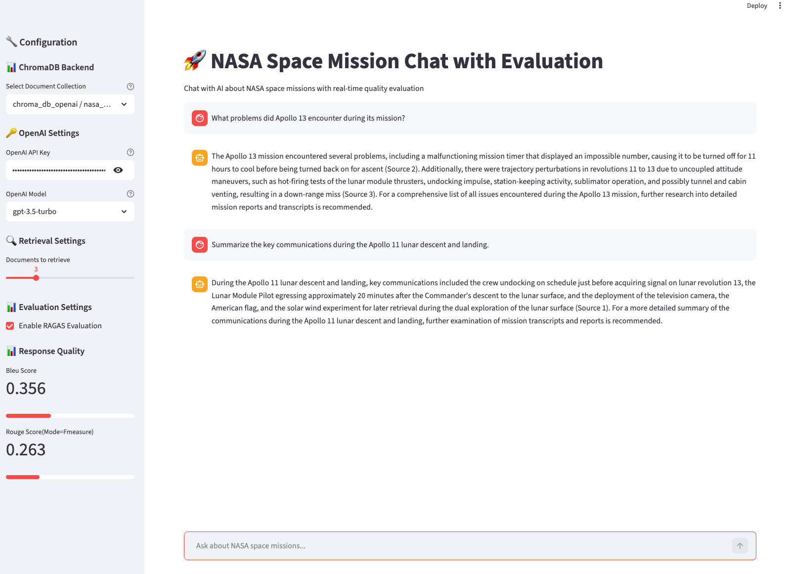

# NASA Mission Intelligence Chat System

A complete Retrieval-Augmented Generation (RAG) system that answers questions
about NASA's Apollo 11, Apollo 13, and Challenger missions using the original
mission transcripts and technical documents shipped under
[`Project-NASA-Mission-Intelligence-Starter/data_text/`](Project-NASA-Mission-Intelligence-Starter/data_text).

The system combines:

- **ChromaDB** — local persistent vector store
- **OpenAI embeddings** (`text-embedding-3-small`) routed through the
  Vocareum proxy
- **OpenAI Chat Completions** (`gpt-3.5-turbo`) for grounded answer generation
- **RAGAS** — real-time evaluation of every answer (relevancy, faithfulness,
  BLEU, ROUGE)
- **Streamlit** — interactive chat UI with a backend selector and
  per-response quality metrics

---

## Screenshots

The Streamlit chat UI in action against the indexed NASA corpus:





---

## Repository Layout

```
.
├── README.md                                     ← this file
├── Project-NASA-Mission-Intelligence-Starter/    ← the project itself
│   ├── chat.py                                   ← Streamlit chat UI
│   ├── rag_client.py                             ← ChromaDB discovery + retrieval
│   ├── llm_client.py                             ← OpenAI chat client
│   ├── embedding_pipeline.py                     ← Document chunker + embedder
│   ├── ragas_evaluator.py                        ← RAGAS metric runner
│   ├── requirements.txt
│   ├── .env.example                              ← template for credentials
│   ├── evaluation_dataset.txt                    ← sample Q&A for evaluation
│   ├── data_text/                                ← raw NASA mission documents
│   │   ├── apollo11/
│   │   ├── apollo13/
│   │   └── challenger/
│   ├── ScrenShot1.png
│   └── Screenshot2.png
└── (course exercise folders)
```

The five Python files in
[`Project-NASA-Mission-Intelligence-Starter/`](Project-NASA-Mission-Intelligence-Starter)
implement the project blueprint:

1. [`embedding_pipeline.py`](Project-NASA-Mission-Intelligence-Starter/embedding_pipeline.py)
   — chunks every `.txt` file in `data_text/`, embeds the chunks with
   OpenAI, and stores them in a ChromaDB collection named
   `nasa_space_missions_text`.
2. [`rag_client.py`](Project-NASA-Mission-Intelligence-Starter/rag_client.py)
   — discovers ChromaDB backends in the project directory, opens a
   collection, runs semantic queries with optional mission filters, and
   formats retrieved documents into context for the LLM.
3. [`llm_client.py`](Project-NASA-Mission-Intelligence-Starter/llm_client.py)
   — wraps the OpenAI Chat Completions API with a NASA-specialist system
   prompt and conversation history.
4. [`ragas_evaluator.py`](Project-NASA-Mission-Intelligence-Starter/ragas_evaluator.py)
   — scores each answer with `ResponseRelevancy`, `Faithfulness`,
   `BleuScore`, and `RougeScore`.
5. [`chat.py`](Project-NASA-Mission-Intelligence-Starter/chat.py)
   — Streamlit application that ties everything together.

---

## Reproducibility

### Tested environment

| Component             | Version                                                    |
| --------------------- | ---------------------------------------------------------- |
| OS                    | macOS (Apple Silicon and Intel both work)                  |
| Python                | 3.11 (3.10–3.12 should also work; 3.13 currently breaks `chromadb`'s native deps) |
| Pinned dependencies   | see [`requirements.txt`](Project-NASA-Mission-Intelligence-Starter/requirements.txt) |
| LLM provider          | OpenAI via Vocareum proxy (`https://openai.vocareum.com/v1`) |
| Chat model            | `gpt-3.5-turbo`                                            |
| Embedding model       | `text-embedding-3-small` (1536 dims)                       |
| Vector store          | ChromaDB persistent client at `./chroma_db_openai/`        |
| Collection name       | `nasa_space_missions_text`                                 |
| Chunk size / overlap  | 1000 chars / 200 chars (sentence-boundary aware)           |
| Default retrieval `k` | 3                                                          |

### One-time setup

```bash
git clone <this-repository>
cd cd13318-exercises-project/Project-NASA-Mission-Intelligence-Starter

# 1. Create + activate a virtualenv (recommended)
python3.11 -m venv .venv
source .venv/bin/activate

# 2. Install pinned dependencies
pip install -r requirements.txt

# 3. Provide your Vocareum / OpenAI credentials
cp .env.example .env
#   then edit .env and paste your key (and base URL) — example:
#       OPENAI_API_KEY=voc-XXXXXXXXXXXXXXXXX
#       OPENAI_BASE_URL=https://openai.vocareum.com/v1
```

The repository's [`.gitignore`](.gitignore) already excludes `.env`, so your
key will not be committed.

### Build the vector store

This step calls the embeddings endpoint once per chunk; all calls go through
Vocareum thanks to `OPENAI_BASE_URL`.

```bash
# from inside Project-NASA-Mission-Intelligence-Starter/
python embedding_pipeline.py --data-path ./data_text
```

Useful options (all default to environment variables when set):

```bash
# Inspect what's already in the collection without making API calls
python embedding_pipeline.py --stats-only

# Re-embed a specific source (delete + add)
python embedding_pipeline.py --data-path ./data_text --update-mode replace

# Use a custom collection name or persist directory
python embedding_pipeline.py \
    --data-path ./data_text \
    --chroma-dir ./chroma_db_openai \
    --collection-name nasa_space_missions_text
```

The pipeline is **idempotent**. Re-running it with the default
`--update-mode skip` will only embed chunks whose stable IDs (formatted as
`mission_source_chunk_0001`) are not already present.

### Launch the chat UI

```bash
# from inside Project-NASA-Mission-Intelligence-Starter/
streamlit run chat.py
```

Then open <http://localhost:8501>. Expected behaviour:

1. The sidebar discovers `chroma_db_openai / nasa_space_missions_text` via
   [`rag_client.discover_chroma_backends()`](Project-NASA-Mission-Intelligence-Starter/rag_client.py:7).
2. The OpenAI API Key field is auto-populated from `.env` (loaded relative
   to the script directory in
   [`chat.py`](Project-NASA-Mission-Intelligence-Starter/chat.py:13)).
3. Asking a question retrieves 3 documents, sends them as context to
   `gpt-3.5-turbo`, displays the answer, and (if RAGAS is enabled) renders
   `Response Relevancy`, `Faithfulness`, `Bleu Score`, and `Rouge Score`
   in the sidebar with progress bars.

### Reproducing the evaluation

The file
[`evaluation_dataset.txt`](Project-NASA-Mission-Intelligence-Starter/evaluation_dataset.txt)
contains 10 questions designed to exercise each mission, comparative
queries, a faithfulness-negative test, and an out-of-scope refusal test.
Walk through them in the chat UI; the sidebar will produce the four
RAGAS scores per question. Expected targets (per RAGAS conventions):

- `nv_response_relevancy` ≥ 0.80
- `faithfulness` ≥ 0.85
- `bleu_score` and `rouge_score` are wording-sensitive sanity checks

If a metric returns `n/a`, an upstream call to the proxy hiccuped — the
evaluator drops `NaN`/`inf` values so the UI never crashes (see
[`ragas_evaluator.py`](Project-NASA-Mission-Intelligence-Starter/ragas_evaluator.py:67)
and the clamp logic in
[`chat.py`](Project-NASA-Mission-Intelligence-Starter/chat.py:90)).

### Determinism notes

- Chunking is fully deterministic (fixed window + sentence-boundary
  snapping). Re-running the pipeline against the same `data_text/` produces
  identical chunk IDs.
- `text-embedding-3-small` is deterministic for identical inputs.
- The chat model uses `temperature=0.2`, so answers are highly stable but
  not bit-identical across runs.
- The RAGAS evaluator uses `temperature=0` for the judge LLM.

### Common issues

| Symptom                                         | Fix                                                                                       |
| ----------------------------------------------- | ----------------------------------------------------------------------------------------- |
| `No ChromaDB backends found!`                   | Run the embedding pipeline once so `chroma_db_openai/` is created.                        |
| `401 Unauthorized` from `api.openai.com`        | Set `OPENAI_BASE_URL=https://openai.vocareum.com/v1` in your `.env` (Vocareum keys won't authenticate against the public OpenAI endpoint). |
| `ModuleNotFoundError: chromadb`                 | You're running with the wrong interpreter. Activate the venv that was used by `pip install`, or call `python3.11` explicitly. |
| `sacrebleu is required for bleu score`          | `pip install -r requirements.txt` (sacrebleu and rouge_score are pinned).                  |
| `Progress Value has invalid value: nan`         | Already handled — make sure you're running the latest `chat.py` and `ragas_evaluator.py`. |

---

## What this project demonstrates

- Building an end-to-end RAG pipeline from raw text to interactive chat.
- Using a vector database (ChromaDB) for semantic search with metadata
  filtering by mission and document category.
- Integrating an LLM with retrieved context, conversation history, and
  domain-specific system prompts.
- Real-time response-quality evaluation with RAGAS metrics surfaced
  directly in the UI.
- Configuration via environment variables and `.env` (including support
  for an OpenAI-compatible proxy such as Vocareum).
